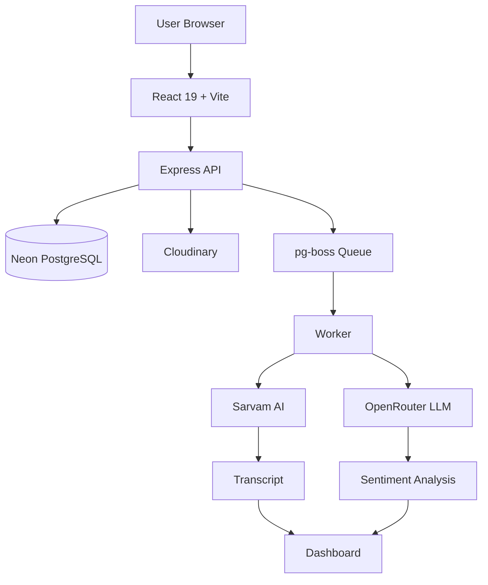
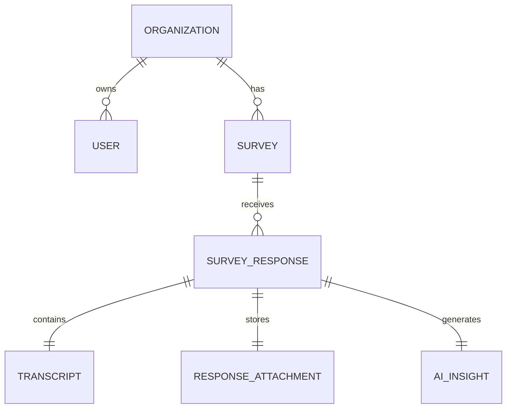
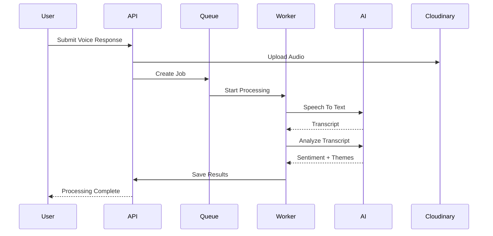

<div align="center">


<a href="#-overview"></a>

<br/>

[](https://react.dev)
[](https://typescriptlang.org)
[](https://tailwindcss.com)
[](https://prisma.io)
[](https://postgresql.org)

[](#)
[](#-license)
[](#)

</div>

<br/>

## 📍 Overview

> **TrueTone turns a 5-second voice note into a structured, actionable insight — no typing, no forms, no friction.**

Businesses lose feedback because forms are boring and nobody fills them out. TrueTone fixes that: a customer scans a QR code, speaks for a few seconds, and walks away. Behind the scenes, TrueTone transcribes the audio, runs it through AI for sentiment/urgency/theme detection, and drops a clean, searchable insight into a live dashboard — often before the customer has even left the building.

<details>
<summary><b>🇮🇳 Padhein Hinglish mein</b></summary>
<br/>

TrueTone ek aisa system hai jo **bolke diya gaya feedback** ko automatically actionable insight mein badal deta hai. Customer QR code scan karta hai, apni baat bolta hai — bas 5 second mein — aur chala jaata hai. Baaki ka kaam TrueTone khud karta hai: audio ko text mein convert karna, AI se sentiment/urgency/themes nikalna, aur ek clean dashboard pe show karna. Koi form fill karne ki zaroorat nahi, isliye response rate bhi kaafi zyada hota hai.

</details>

<br/>

### Why teams use it

| | |
|---|---|
| 🗣️ **Zero-friction input** | Speaking is 3x faster than typing — response rates go up because there's nothing to fill out |
| 🌐 **Hindi + English native** | Built for real Indian users, not just English-first markets |
| ⚡ **Insight, not raw data** | You get sentiment, urgency, and themes — not a pile of audio files to sift through |
| 🏢 **Multi-tenant from day one** | Every organization's data is isolated, auditable, and secure |

<details>
<summary><b>🇮🇳 Padhein Hinglish mein</b></summary>
<br/>

- **Zero-friction input** — bolna, type karne se kaafi fast hai, isliye zyada log respond karte hain
- **Hindi + English native** — real Indian users ke liye banaya gaya hai
- **Insight, not raw data** — aapko sentiment, urgency, aur themes milte hain, na ki sirf audio files ka dhair
- **Multi-tenant from day one** — har organization ka data alag aur secure rehta hai

</details>

<br/>

## 🖥️ See It In Action

<div align="center">

</div>

<br/>

## 🏗️ Architecture



<details>
<summary><b>🇮🇳 Architecture Hinglish mein samjhein</b></summary>
<br/>

User apne browser se React app (Vite pe chal raha hai) kholta hai aur apna voice response record karta hai. Ye request Express API ke paas jaati hai, jo audio ko Cloudinary pe store karta hai aur ek background job create karta hai pg-boss queue mein. Ek separate Worker process is job ko pick karta hai — pehle Sarvam AI se speech-to-text transcript nikalta hai, phir OpenRouter LLM se sentiment aur themes detect karta hai. Final result Neon PostgreSQL database mein save hota hai aur dashboard pe turant reflect hota hai.

</details>

<br/>

## ✨ Features

<table>
<tr>
<td width="50%" valign="top">

**🎤 Voice Collection**
- Browser-based recording, no app install
- Live waveform visualization
- Native Hindi + English support

**🤖 AI Processing**
- Automatic transcription
- Sentiment & urgency detection
- Theme extraction + AI summary
- Actionable recommendations

</td>
<td width="50%" valign="top">

**📊 Dashboard**
- Survey management
- Full response history
- Sentiment & theme charts
- Executive summary view

**🔐 Security**
- JWT auth + bcrypt hashing
- Multi-tenant org isolation
- Rate limiting

</td>
</tr>
</table>

<details>
<summary><b>🇮🇳 Features Hinglish mein</b></summary>
<br/>

- **Voice Collection** — browser mein hi recording ho jaati hai, koi app install nahi karna; Hindi aur English dono support karta hai
- **AI Processing** — transcription, sentiment, urgency, themes, aur summary sab automatic
- **Dashboard** — surveys manage karo, response history dekho, charts ke through insights samjho
- **Security** — JWT auth, password hashing, aur har organization ka data alag-alag secure rehta hai

</details>

<br/>

## 🛠️ Tech Stack

<div align="center">

</div>

<br/>

<table>
<tr>
<th>Layer</th>
<th>Stack</th>
</tr>
<tr>
<td><b>Frontend</b></td>
<td>React 19 · TypeScript · Vite · Tailwind CSS v4 · shadcn/ui · React Router v7 · Recharts · WaveSurfer.js</td>
</tr>
<tr>
<td><b>Backend</b></td>
<td>Express.js · TypeScript · Prisma ORM · PostgreSQL · pg-boss · JWT · bcrypt · Zod</td>
</tr>
<tr>
<td><b>External Services</b></td>
<td>Cloudinary (storage) · Sarvam AI (speech-to-text) · OpenRouter (LLM analysis)</td>
</tr>
</table>

<br/>

## 🌐 Deployment

| Service | Platform |
|---|---|
| Frontend | Vercel |
| Backend | Render |
| Database | Neon PostgreSQL |
| Storage | Cloudinary |
| Queue | pg-boss |
| AI | Sarvam AI + OpenRouter |

<div align="center">
<sub>Runs end-to-end on free tiers — zero infra cost to demo or fork.</sub>
</div>

<br/>

## 📊 Database Design



Design highlights: Prisma ORM · `cuid()` IDs · JSON fields for flexible AI output · atomic transactions · enum constraints for data integrity.

<br/>

## 🔄 Processing Flow



<br/>

## 🚀 Quick Start

```bash
# Clone the repo
git clone https://github.com/your-username/truetone.git
cd truetone

# Install dependencies
cd client && npm install
cd ../server && npm install

# Set up environment variables
cp .env.example .env

# Run database migrations
npx prisma migrate dev

# Start the app
npm run dev        # server
cd ../client && npm run dev   # client
```

<details>
<summary><b>🇮🇳 Setup Hinglish mein</b></summary>
<br/>

1. Repo clone karo aur usme jao
2. `client` aur `server` dono folders mein `npm install` chalao
3. `.env.example` ko copy karke `.env` banao aur apni keys daalo (Cloudinary, Sarvam, OpenRouter, database URL)
4. `npx prisma migrate dev` se database tables create ho jaayenge
5. Server aur client dono `npm run dev` se start kar do — bas ho gaya

</details>

<br/>

## 📂 Project Structure

```text
client/
├── src/
│   ├── pages/
│   ├── components/
│   ├── hooks/
│   └── lib/

server/
├── prisma/
│   └── schema.prisma
├── src/
│   ├── controllers/
│   ├── middleware/
│   ├── routes/
│   ├── workers/
│   ├── lib/
│   │   ├── process-response.ts
│   │   ├── sarvam.ts
│   │   └── openrouter.ts
│   └── app.ts
```

<br/>

## 🗺️ Roadmap

- [ ] WhatsApp-based feedback submission
- [ ] Configurable alert rules for negative feedback
- [ ] Export insights to CSV / PDF
- [ ] Multi-language support beyond Hindi/English

<br/>

## 🤝 Contributing

Issues and PRs are welcome — this started as a portfolio project but it's built to be extended. Open an issue before a large PR so the direction can be discussed first.

<br/>

## 📜 License

This project is intended for educational and portfolio purposes.

<br/>

<div align="center">


**Turning conversations into actionable insights, one voice note at a time.**

</div>
